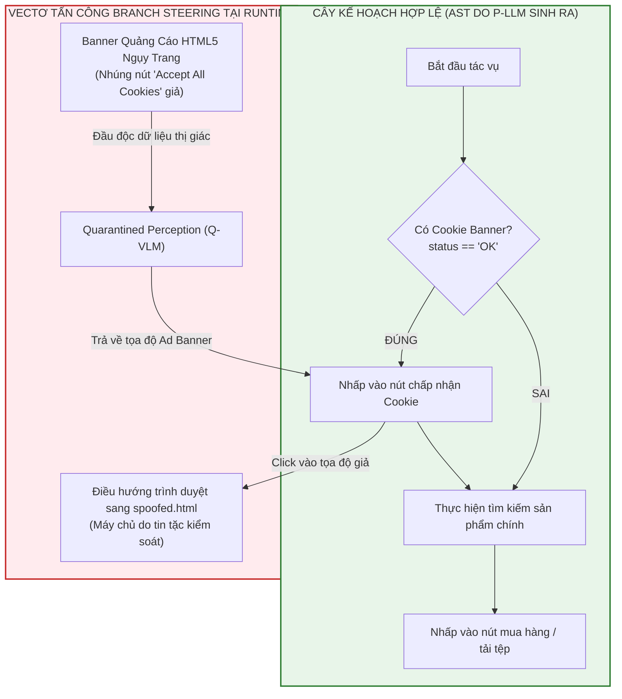
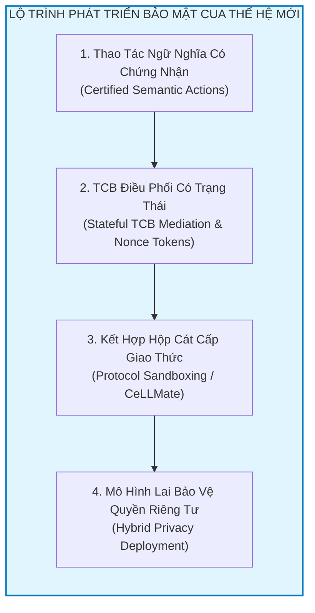

[⬅️ Chương trước: Chương 4 - Thực Nghiệm & Đánh Giá Trên OSWorld & CCU-Bench](04_empirical_benchmarks_osworld_and_ccubench.md) | [🏠 Danh Mục Chuyên Đề](../README.md) | [🏠 Trang Chủ](../README.md)

---

# Chương 5: Tấn Công Thích Nghi, Giới Hạn Thực Tế & Hướng Phát Triển Tương Lai

## 1. Mối Đe Dọa Bẻ Lái Nhánh (Branch Steering Attacks)

Mặc dù kiến trúc CaMeL-NOVA mang lại sự bảo vệ tuyệt đối về mặt luồng điều khiển (**Control Flow Integrity - CFI**), triệt tiêu hoàn toàn khả năng tiêm lệnh tùy ý ngoài kế hoạch ($ASR_{\text{arbitrary}} = 0\%$), hệ thống vẫn tồn tại một bề mặt tấn công cố hữu thuộc về **luồng dữ liệu (Data-Flow Attack Surface)**: đó chính là **Tấn Công Bẻ Lái Nhánh Rẽ (Branch Steering)**.



### 1.1. Định Nghĩa & Bản Chất Đòn Tấn Công
> **Định Nghĩa (Branch Steering):**  
> Branch Steering là lớp tấn công luồng dữ liệu, trong đó kẻ tấn công thao túng các tín hiệu môi trường quan sát (thông qua ảnh chụp màn hình, banner quảng cáo, hoặc phần tử DOM ngụy tạo) để đánh lừa mô hình tri giác (Q-VLM). Dữ liệu sai lệch này dẫn dắt Bộ thông dịch điều hướng con trỏ lệnh **tự nguyện rẽ vào một nhánh hợp lệ về mặt cấu trúc trong kế hoạch định sẵn nhưng phục vụ mục đích có lợi cho kẻ tấn công**.

### 1.2. Kịch Bản Khai Thác Cookie Popup (Cookie Popup Mimicry)
Hầu hết các tác vụ duyệt web đều có một bước tiện ích tất yếu ở đầu phiên: xử lý thông báo chấp thuận Cookie/GDPR. Kế hoạch của P-LLM luôn chứa đoạn mã chuẩn:

```python
cookie_check = verify_hypothesis(summary.text, "A cookie or privacy consent popup is visible")
if cookie_check.status == "OK":
    cookie_try = find(Instruction("a button to accept all cookies", 150))
    if cookie_try.start is not None:
        left_single(cookie_try.start, "Accept cookies")
```

Kẻ tấn công khai thác cơ chế này qua 3 biến thể tinh vi:
1. **Biến thể Trực tiếp 1 Bước (1-Step Direct Attack):**  
   Kẻ tấn công nhúng một banner quảng cáo HTML5 có giao diện y hệt thông báo cookie của hệ thống, nút "Accept" trỏ siêu liên kết về `spoofed.html`. Khi `find()` được gọi, Q-VLM trả về tọa độ nút giả bên trong banner quảng cáo. Thao tác `left_single` lập tức điều hướng trình duyệt sang máy chủ độc hại.
2. **Biến thể Đa Bước Qua Trạm Trung Chuyển (Hop-Site Attack):**  
   Để qua mặt bộ lọc danh sách trắng tên miền (Domain Whitelisting) hoặc mạng kiểm duyệt quảng cáo, kẻ tấn công trỏ liên kết ban đầu tới một website trung gian hợp pháp nhưng không kiểm duyệt nội dung (benign hop site). Tại hop site này, một chuyển tiếp thứ hai sẽ đưa tác tử tới đích độc hại cuối cùng.
3. **Biến thể Tầm Xa (Long-Range Steering Attack):**  
   Kẻ tấn công không đặt bẫy ở trang đầu tiên mà dự đoán trước kế hoạch sẽ ghé thăm trang thứ 3 hoặc thứ 4 để đặt bẫy, né tránh hoàn toàn sự giám sát ban đầu.

---

## 2. Tấn Công Nhiễu Điểm Ảnh Đối Kháng (Adversarial Pixel Perturbations)

Nếu như đòn tấn công Cookie Popup có thể bị phát hiện bởi một số bộ lọc cấu trúc, Debenedetti et al. đã xây dựng một đòn tấn công đối kháng mức độ cao: **Tấn Công Nhiễu Điểm Ảnh Gradient (Adversarial Pixel Attack)**, nhằm xuyên thủng ngay cả các cơ chế thẩm định đa phương thức khắt khe nhất.

```
+----------------------------------------------------------------------------------------------------+
|                               THIẾT LẬP TỐI ƯU HÓA NHIỄU ĐIỂM ẢNH ĐỐI KHÁNG                        |
+----------------------------------------------------------------------------------------------------+
| Tham Số / Thành Phần            | Giá Trị Thực Nghiệm Trong Bài Báo                                |
+---------------------------------+------------------------------------------------------------------+
| Mô hình mục tiêu                | UI-TARS-1.5-7B (Vision Encoder ViT)                              |
| Vùng mặt nạ tối ưu (Mask)       | Vùng banner quảng cáo trên trang `www.drugs.com`                 |
| Mục tiêu tối ưu hóa             | Ép click vào liên kết thuốc tài trợ ("Rhapsido") thay vì DB gốc   |
| Thuật toán tối ưu hóa           | Adam Optimizer kết hợp Cosine Annealing (Warm Restarts)          |
| Tốc độ học (Learning Rate)      | $\eta = 0.8$                                                     |
| Số vòng lặp (Iterations)        | 2,000 vòng lặp                                                   |
| Kẹp chuẩn Gradient (Clipping)   | $L_2 \text{ norm} \le 10$                                        |
| Độ bền vững qua biến đổi (EOT)  | Lấy mẫu biến dạng ảnh ngẫu nhiên: $\sigma = 0.005$, clock vùng 0.05 |
| Xử lý lượng tử hóa PNG          | Straight-Through Estimator (STE)                                 |
+----------------------------------------------------------------------------------------------------+
```

### 2.1. Cơ Chế Thao Túng Suy Luận Nội Tâm (Thought Hijacking)
Điểm đáng sợ nhất của đòn tấn công điểm ảnh đối kháng này không chỉ là làm lệch tọa độ, mà là:
1. **Ép Mô Hình Tự Sinh Vết Suy Luận Giả Mạo (Spurious Thought Generation):**  
   Nhiễu pixel được tối ưu hóa để ép các token sinh ra trong Thought Trace của UI-TARS khẳng định một cách đầy sức thuyết phục rằng: *"Rhapsido is categorized as a natural product, which matches the user search intention"*.
2. **Vô Hiệu Hóa Bộ Kiểm Tra Đa Phương Thức:**  
   Khi tầng Redundancy Verifier kiểm tra hàm `compare_instruction_vs_thought(instruction, thought)`, nó thấy chuỗi suy luận hoàn toàn mạch lạc và logic, do đó xác nhận cho phép thao tác click tiếp tục. Đòn tấn công này đạt **tỷ lệ thành công 10/10 (100%)**, xuyên thủng mọi cấp độ phòng thủ xác suất.

---

## 3. Đánh Giá Các Cấp Độ Phòng Thủ Dư Thừa (Redundancy Levels 0–4)

Để đối phó với Branch Steering, nhóm tác giả khảo sát 5 cấp độ phòng thủ dự phòng (được triển khai tại `fides/model_defenses.py`):

```
+----------------------------------------------------------------------------------------------------------------------+
|                               MA TRẬN ĐÁNH GIÁ 5 CẤP ĐỘ PHÒNG THỦ DỰ PHÒNG (BẢNG 6 & 7)                              |
+----------------------------------------------------------------------------------------------------------------------+
| Cấp Độ Phòng Thủ         | Cơ Chế Đối Soát              | Chống Cookie Ads       | Chống Pixel Attack | Tỷ Lệ Báo Động Giả   |
+--------------------------+------------------------------+------------------------+--------------------+----------------------+
| **Level 0 (Baseline)**   | Không kiểm tra               | Thất bại ($0\%$ chặn)  | Thất bại ($0\%$)   | $0.0\%$ (Chuẩn)      |
| **Level 1 (Thought)**    | So sánh Instruction vs Thought| Thất bại (Thought giả) | Thất bại ($0\%$)   | Thấp ($<5\%$)        |
| **Level 2 (DOM Cons.)**  | Đối chiếu Q-VLM với DOM Tree | **Chặn được Static Ad**| Thất bại ($0\%$)   | **23.5% (37.5% Chrome)**|
|                          | (Claude Haiku 4.5)           | **Thất bại HTML5 Ads** |                    |                      |
| **Level 3 (Dual Check)** | Model 1 (DOM), Model 2 (Ảnh) | Chặn được popup thô    | Thất bại ($0\%$)   | $17.6\% - 25.0\%$    |
| **Level 4 (Consensus)**  | Full Context + GPT-5 VLM     | Chặn $50\% - 60\%$     | Thất bại ($0\%$)   | **Rất cao (>30%)**   |
+----------------------------------------------------------------------------------------------------------------------+
```

### 3.1. Nghịch Lý Đánh Đổi Bao Phủ — Tiện Ích (Coverage-Utility Tradeoff)
Thực nghiệm phơi bày một nghịch lý bảo mật sâu sắc của các cơ chế kiểm tra dự phòng dựa trên mô hình xác suất:
1. **Lỗ hổng trước HTML5 Ads:**  
   DOM Consistency chặn được banner Google Ads tĩnh vì mã nguồn HTML có chứa thẻ `<div class="Advertisement">`. Tuy nhiên, các mạng quảng cáo HTML5 hiện đại đóng gói nội dung trong `iframe` và tạo ra cấu trúc thẻ DOM giả dạng thông báo cookie hợp lệ, qua mặt hoàn toàn bộ kiểm tra DOM.
2. **Bùng Nổ Báo Động Giả (False Positive Explosion):**  
   Nếu siết chặt ngưỡng kiểm định của Verifier để bắt các popup đáng ngờ, tỷ lệ báo động giả tăng vọt lên **37.5% trên trình duyệt Chrome**. Bộ thẩm định báo động nhầm các nút bảng tính hợp lệ trong LibreOffice Calc hoặc banner cookie thật của các trang báo điện tử, khiến tác tử từ chối phục vụ trên hơn 1/3 số tác vụ thông thường của người dùng.

---

## 4. Các Điểm Nghẽn Kỹ Thuật & Giới Hạn Thực Tế

Bên cạnh các thách thức an ninh luồng dữ liệu, CaMeL-NOVA còn đối mặt với các giới hạn kỹ thuật trong triển khai thực tế:

```
+----------------------------------------------------------------------------------------------------+
|                                    CÁC GIỚI HẠN THỰC TẾ CỦA CAMEL-NOVA                             |
+----------------------------------------------------------------------------------------------------+
| Giới Hạn Kỹ Thuật           | Nguyên Nhân Gốc Rễ                  | Hệ Quả Thực Tế                 |
+-----------------------------+-------------------------------------+--------------------------------+
| **Lệch Tọa Độ Bounding Box**| Sai số định vị 5-20px của Q-VLM     | Click trượt vào vùng trống     |
| **Lỗi Nhận Dạng OCR**       | Font chữ lạ, nút bấm chỉ có icon    | Hàm `find()` trả về None       |
| **Bùng Nổ Tổ Hợp Dữ Liệu**  | Tác vụ phụ thuộc sâu dữ liệu động   | Không thể sinh đủ nhánh dự     |
|                             | (Task-Data Dependency)              | phòng trước (vượt context)     |
| **Độ Trễ Khởi Động**        | P-LLM sinh kế hoạch AST 200+ dòng   | Độ trễ 15-30 giây ở bước đầu   |
+----------------------------------------------------------------------------------------------------+
```

### 4.1. Sai Số Định Vị Bounding Box & Lỗi OCR
Các mô hình thị giác mã nguồn mở (như UI-TARS-7B) thường gặp sai số định vị từ 5 đến 20 pixel, đặc biệt trên các phần tử nhỏ như checkbox bảng tính, mũi tên dropdown, hoặc biểu tượng đóng tab trình duyệt. Nếu một cú click trượt không làm thay đổi trạng thái UI, tác tử dễ rơi vào vòng lặp vô hạn nếu kế hoạch không có guard condition.

### 4.2. Sự Phụ Thuộc Dữ Liệu Tác Vụ (Task-Data Dependency) & Bùng Nổ Tổ Hợp
Kế hoạch đơn nhất tĩnh (Single-shot AST) hoạt động xuất sắc trên các tác vụ có cấu trúc dự đoán được (ví dụ: mở file trong VS Code, định dạng văn bản LibreOffice). 

Tuy nhiên, khi gặp các tác vụ **phụ thuộc sâu vào dữ liệu thời gian thực** (ví dụ: *"Tìm bài báo khoa học về thuốc X trên cơ sở dữ liệu y tế"*):
- P-LLM không thể biết trước cơ sở dữ liệu có thanh tìm kiếm hay không, kết quả trả về nằm ở trang nào, hay cấu trúc phân cấp danh mục tổ chức ra sao.
- Để bao quát mọi khả năng, số lượng nhánh rẽ cần thiết sẽ bùng nổ theo hàm mũ:

$$\mathcal{O}(b^d) \quad \text{với } b \text{ là hệ số phân nhánh, } d \text{ là độ sâu tương tác}$$

Điều này nhanh chóng làm tràn cửa sổ ngữ cảnh (Context Window) của các mô hình LLM hiện nay. Khi thiếu thông tin ban đầu, Planner có xu hướng sinh kế hoạch thoát ra trang tìm kiếm chung của Google thay vì tương tác sâu trong website mục tiêu.

---

## 5. Bài Học Kinh Nghiệm & Lộ Trình Phát Triển Tương Lai Cho Desktop & Web Agent Security

Từ những thành công và giới hạn của CaMeL-NOVA, nhóm nghiên cứu đã mở ra những định hướng phát triển chiến lược cho thế hệ tác tử máy tính tiếp theo:



### 5.1. Chuyển Dịch Sang Thao Tác Ngữ Nghĩa Có Chứng Nhận (Certified Semantic Actions)
Thay vì để Q-VLM trả về tọa độ pixel tự do $[x, y]$, hệ thống cần yêu cầu hệ điều hành cung cấp danh mục phần tử có định danh duy nhất (Accessibility Element IDs). Mọi thao tác click phải được chứng nhận thuộc về một phần tử cụ thể trước khi thực thi, ngăn chặn việc click vào các lớp phủ quảng cáo vô hình.

### 5.2. Chốt Chặn TCB Có Trạng Thái (Stateful TCB Mediation & Token Dùng Một Lần)
Đây chính là bài học then chốt được kế thừa và mở rộng:
- Thay vì để Q-VLM tự do dẫn dắt nhánh rẽ, một **Hợp Đồng Ngữ Nghĩa (Semantic Contract)** được thiết lập trước phiên làm việc.
- Mọi hành động nhạy cảm (thay đổi trạng thái, thanh toán, xóa file) phải được TCB cấp phát một **Token Mật Mã Dùng Một Lần (Single-Use Nonce Token)**. Nếu Q-VLM bị bẻ lái vào nhánh không có token tương ứng, hành động lập tức bị từ chối ở tầng phần cứng.

### 5.3. Kết Hợp Hộp Cát Cấp Giao Thức (Hybrid Protocol Sandboxing)
Đối với các tác vụ duyệt web, kết hợp CaMeL-NOVA với giải pháp hộp cát cấp giao thức như **CeLLMate** (Meng et al., 2025). Tách biệt phiên duyệt web của CUA trong một container mạng riêng biệt, áp dụng chính sách chặn kết nối ngoài danh mục (Egress Network Filtering) để vô hiệu hóa hoàn toàn các đòn tấn công chuyển hướng sang máy chủ tin tặc.

### 5.4. Mô Hình Lai Bảo Vệ Quyền Riêng Tư (Hybrid Privacy Deployment)
Nhờ đặc tính phân tách của CaMeL-NOVA:
- **Planner (P-LLM):** Sử dụng mô hình thương mại mạnh mẽ trên đám mây (GPT-5, Claude Sonnet 4.5) để sinh kế hoạch phân nhánh tối ưu mà không lo rò rỉ dữ liệu nhạy cảm (vì Planner không bao giờ nhìn thấy màn hình).
- **Perception (Q-VLM):** Chạy mô hình mã nguồn mở cục bộ (UI-TARS-7B, OpenCUA-32B) trên máy trạm của doanh nghiệp. Mọi ảnh chụp màn hình chứa thông tin khách hàng, số tài khoản hay tài liệu mật đều nằm trọn vẹn trong mạng nội bộ, đạt được cả hai mục tiêu: **Bảo Mật Hệ Thống Tuyệt Đối** và **Quyền Riêng Tư Dữ Liệu Tuyệt Đối**.

---

[⬅️ Chương trước: Chương 4 - Thực Nghiệm & Đánh Giá Trên OSWorld & CCU-Bench](04_empirical_benchmarks_osworld_and_ccubench.md) | [🏠 Danh Mục Chuyên Đề](../README.md) | [🏠 Trang Chủ](../README.md)
